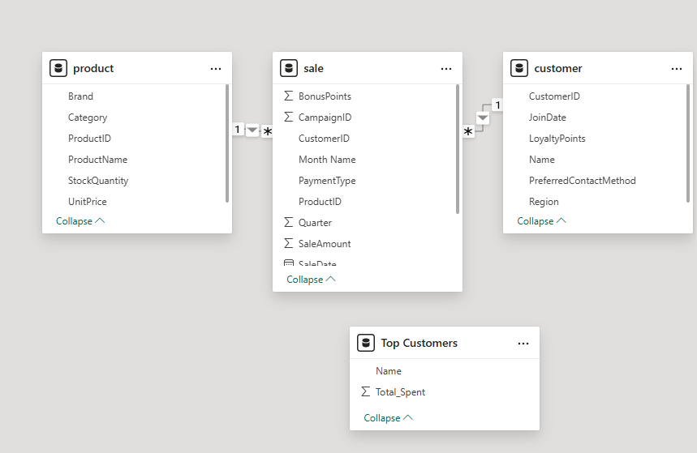
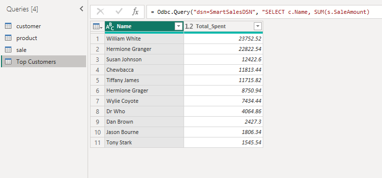
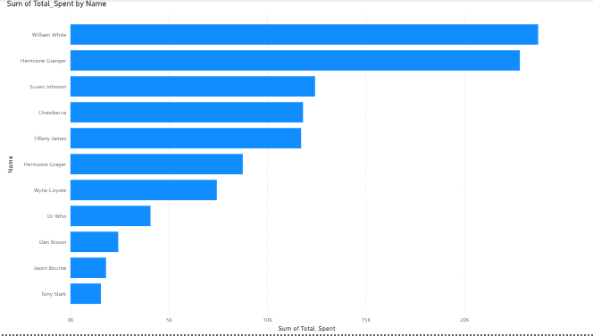
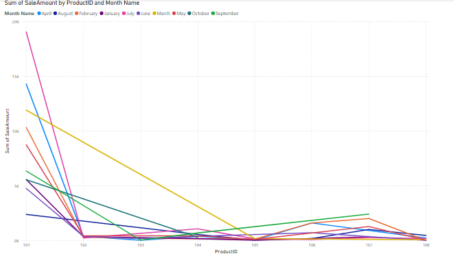
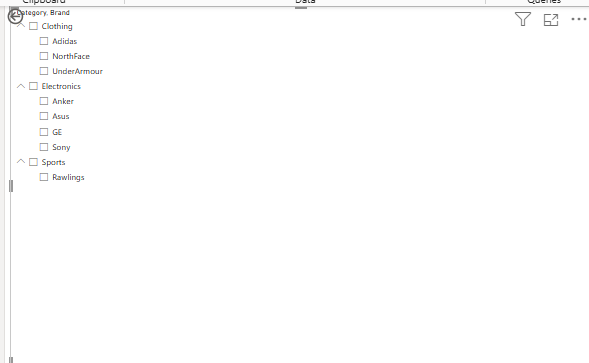
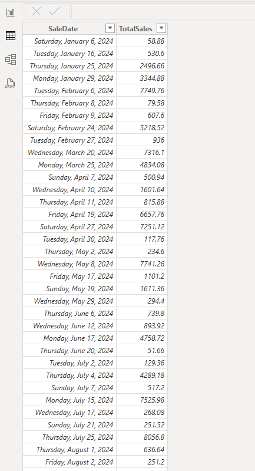
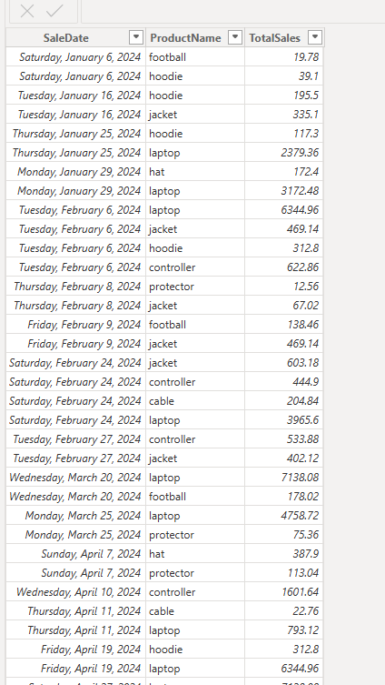
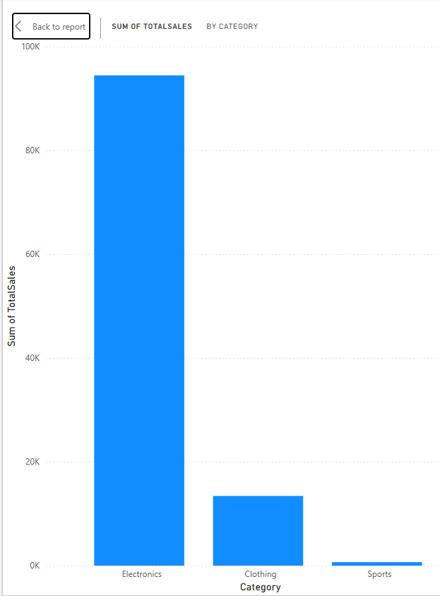
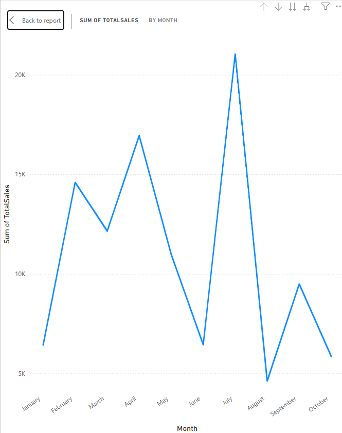
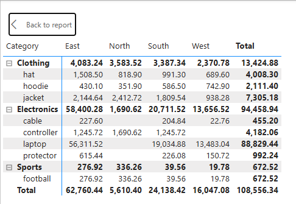

# smart-store-pinkston
## Smart-Sales Project

### Smart-Sales-Starter-Files
#### Step 1 - Create and Activate Project Virtual Environment
```shell
py -m venv .venv
.venv\Scripts\Activate
```

#### Step 2 - Install and Update packages from requirements.txt
```shell
py -m pip install --upgrade -r requirements.txt
```

#### Step 3 - Run the Initial project script
```shell
py scripts\data_prep.py
```

#### Step 4 - Prepare and clean data
```shell
py scripts\data_preparation\prepare_customers_data.py
py scripts\data_preparation\prepare_products_data.py
py scripts\data_preparation\prepare_sales_data.py
```

#### Step 5 - Create data warehouse and database tables
##### The data warehouse will use a star schema consisting of two dimension tables (customer and product) and one fact table (sale).
```shell
py scripts\etl_to_dw.py
```

#### Step 6 - Create DSN (SmartSalesDSN) and connect Microsoft Power BI Desktop to ODBC Data Source (SmartSalesDSN)



##### Use Power BI to create a "Top Customers" SQL query that will query total sales per customer



##### Use Power BI to create visualizations:  bar chart of Top Customers query, line chart of Sales Trends, and a slicer displaying product brands by category.







#### Step 7 - BI Insights and Storytelling
##### Use OLAP Analysis and visualizations to identify business insights
###### Section 1. The Business Goal - Identify low-performing products by analyzing total sales of less than $1,000 and sales trends over time by product category and region. The results can be used to determine which products need to be discontinued or another strategy implemented.

###### Section 2. Data Source - Start with a pre-computed cube in Microsoft Power BI. The following tables and columns will be used:
* Table - sale, Columns - SaleDate, SalesAmount
* Table - product, Columns - Category, ProductName
* Table - customer, Columns - Region

###### Section 3. Tools - SQLite and Microsoft Power BI will be used for this analysis. The data warehouse was previously created in SQLite and was previously connected to Power BI. Power BI supports SQL queries and the creation of visualizations.

###### Section 4. Workflow & Logic
* Dimensions - SaleDate, Category, ProductName, Region
* Metric - SalesAmount
* Aggregations - Sum of SalesAmount





###### Section 5. Results - The OLAP analysis using SQL and Power BI successfully determined which product to discontinue due to poor sales performance. The following visuals help provide these insights.







###### Section 6. Suggested Business Action - Based on the analysis, it is recommended to remove cable, footballs, and protectors for the sales inventory.

###### Section 7. Challenges - I did not encounter any challenges.